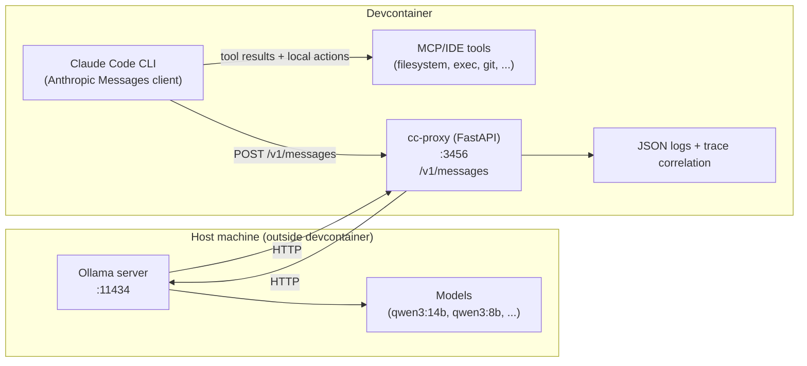
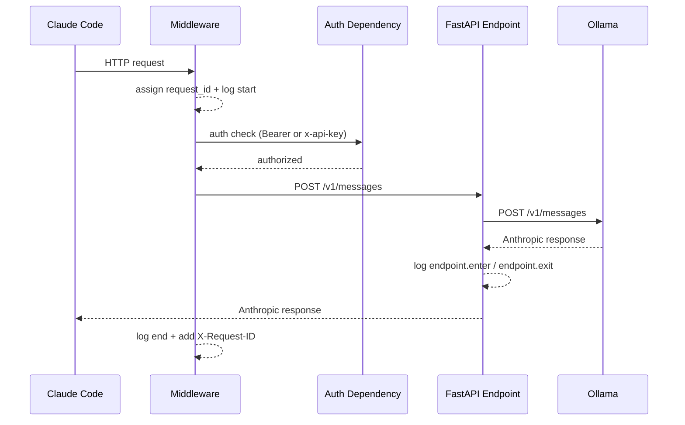

# Claude Code ↔ Ollama Compatibility Proxy — architecture

## Short intro

`cc-proxy` is a FastAPI gateway that makes Claude Code work reliably with local Ollama models by enforcing an Anthropic‑compatible contract and adding observability. It is designed for a devcontainer setup where Claude Code runs inside the container and Ollama runs on the host.

## Underlying demand description

We need Claude Code + local models to behave predictably for **tool/agent workflows**, not just basic chat. That requires:
- reliable Anthropic‑shaped requests and responses
- strict authentication at the proxy boundary
- request correlation and traceability for debugging
- compatibility with the devcontainer networking model

## Existing solutions

- **LiteLLM**: a general gateway and routing layer. Good for model access, but it does not guarantee deterministic tool‑call repair and Anthropic contract enforcement.
- **Claude‑code‑router (CCR)**: a Node.js proxy that routes Claude Code requests to multiple providers and supports transformer pipelines. It *can* help by converting Anthropic‑style requests into OpenAI‑style requests for Ollama and by applying transformers like `tooluse`, `enhancetool`, and `reasoning` for tool‑call tolerance. However, it is a separate stack with its own runtime, config model, and lifecycle (`ccr` CLI, `~/.claude-code-router/config.json`). It does not provide a repo‑owned, Python/FastAPI‑based integration with our observability and auth conventions, and it still depends on local model quality for consistent tool calling. For this project, we avoided introducing a Node.js production dependency due to recent vulnerabilities and preferred a single‑stack FastAPI implementation that we can fully control and test.
- **Ollama native Claude Code integration**: direct Anthropic‑compatible API integration, but it does not address local model quirks like malformed tool calls. See Ollama’s guide: https://docs.ollama.com/integrations/claude-code

## Identified feature gaps

- **Tool‑call reliability**: local models can return malformed tool calls (stringified JSON inputs, missing IDs).
- **Request adaptation**: Claude Code sends Anthropic‑specific fields that local backends do not support.
- **Auth variability**: Claude Code may use either `Authorization: Bearer` or `x-api-key`.
- **Observability**: without structured logs and traces, diagnosing failures is difficult.

## Features of this solution

Current capabilities (in this repo):
- **Anthropic‑compatible façade** with `GET /health` and `POST /v1/messages`.
- **Anthropic‑compatible upstream** to Ollama (`POST {OLLAMA_BASE_URL}/v1/messages`).
- **Auth enforcement** via `CC_PROXY_AUTH_KEY`, accepting **either** `Authorization: Bearer` or `x-api-key`.
- **Request logging middleware** with `X-Request-ID` propagation.
- **OpenTelemetry‑compatible JSON logging** with `trace_id`/`span_id` correlation.
- **FastAPI instrumentation** (best‑effort) for server spans.
- **OTel export model**: the proxy exports OTLP to an external Collector (sidecar/agent/service). The Collector is not embedded in the app process.
- **Request adaptation**: Strips unsupported Anthropic fields (`metadata`, `tool_choice`, `prompt_caching`, `cache_control`).
- **Thinking policy**: Drops thinking/redacted_thinking blocks for non-capable models with warning headers and log events.
- **Tool calling support**: Passes tool definitions and tool blocks, detects "use_tools" marker and injects system instructions, repairs malformed tool_use blocks, and enforces tool capability checks.
- **Tool capability detection**: Uses whitelist + `/api/show` capabilities with an in-memory cache.
- **Model alias resolution**: Maps `sonnet`/`haiku`/`opus` to actual Ollama models via user config.
- **Configurable timeout**: Supports `OLLAMA_TIMEOUT_SECONDS` with unit suffixes (ms, s, m, h).

- **Streaming responses**: Supports SSE streaming with NDJSON fallback parsing; tool-call streaming is gated and tool repair is limited to `content_block_start` tool_use events.

Target capabilities (not yet implemented):
- Model profiling for shareable "known issues" data.

## Architecture description (static architecture diagram)

This repo assumes:
- Claude Code runs **inside the devcontainer**
- Ollama runs **on the host** at `http://host.docker.internal:11434`



## Code flow (dynamic diagram)

The current implementation forwards requests to Ollama’s Anthropic‑compatible
`/v1/messages` endpoint. The request flow includes middleware, auth, and observability.



## Repo structure and API description

### Repo structure (current)

```
cc_proxy/
├── app/
│   ├── apps_env.py                 # load cc_proxy/.env
│   ├── auth.py                     # auth dependency (Bearer/x-api-key)
│   ├── main.py                     # FastAPI app, lifespan, routes
│   ├── settings.py                 # centralized configuration (Settings class)
│   ├── middleware_request_logging.py
│   ├── models_anthropic.py         # Anthropic request/response models
│   ├── models_ollama.py            # Ollama request/response models
│   ├── adapt_request.py            # request adaptation (field filtering, thinking policy)
│   ├── adapt_response.py           # response adaptation (Anthropic compat + repair)
│   ├── routing.py                  # model alias resolution, config loading
│   ├── transport.py                # Ollama HTTP client (with connection pooling)
│   ├── capability.py               # tool capability detection + cache
│   ├── tool_repair.py              # tool_use repair helpers
│   ├── observability.py            # JSON logging, OTel setup, LogEvent constants, emit_span_event
│   └── request_context.py          # request_id contextvar
├── tests/
│   ├── conftest.py                 # fixtures, shared utilities (load_jsonl_fixture, has_tool_use)
│   ├── utils.py                    # test utilities (assert_ollama_reachable, subprocess helpers)
│   └── test_*.py                   # unit + integration tests
```

### API surface (current)

- `GET /health`
  - Returns `{ "status": "ok" }`.
  - Emits `endpoint.enter` / `endpoint.exit` events.
- `POST /v1/messages`
  - Requires auth via `Authorization: Bearer <key>` or `x-api-key: <key>`.
  - Returns an Anthropic‑shaped response (`MessagesResponse`) from Ollama upstream.
  - Emits endpoint events and auth trace events.

## Used features from FastAPI

- **Routing**: `@app.get`, `@app.post` for endpoints.
- **Dependencies**: `Depends(auth_dependency)` for auth enforcement.
- **Middleware**: request lifecycle logging and `X-Request-ID`.
- **Pydantic models**: request/response schemas in `models_anthropic.py`.
- **OpenTelemetry instrumentation**: FastAPIInstrumentor (best‑effort import).

## Testing approach

Tests are written in `cc_proxy/tests` and focus on:
- **Auth behavior** (`test_api_auth.py`, `test_api_auth_otel_events.py`)
- **Request logging middleware** (`test_request_logging_middleware.py`)
- **Observability and JSON log schema** (`test_observability_logging.py`, `test_json_log_utils.py`)
- **Endpoint behavior** (`test_api_messages_stub.py`, `test_api_endpoint_events.py`)
- **Tracing spans** (`test_api_tracing_spans.py`)
- **Request/response adaptation** (`test_adapt_request_*.py`, `test_adapt_response_*.py`)
- **Routing and aliases** (`test_routing_*.py`)
- **Thinking policy** (`test_thinking_*.py`, `test_api_thinking_warning_header.py`, `test_logging_thinking_policy.py`)
- **Tool calling** (`test_tool_*.py` - passthrough, sequence patterns, use_tools marker)
- **Transport layer** (`test_transport_*.py` - OpenAI-compat, Anthropic-compat)
- **Claude Code integration** (`test_claude_*.py` - CLI smoke tests, request integration, sequence patterns)
- **Repo workflow and setup** (`test_repo_*` suite)
- **OTel Collector wiring** (`test_repo_otelcol_*`)
- **Ollama integration** (`test_proxy_ollama_integration.py`, `test_ollama_model_performance.py`)

## Further details

- Authentication contract: `docs/cc-proxy-authentication.md`
- Logging and OpenTelemetry: `docs/cc-proxy-logging.md`
- Detailed implementation plan: `docs/cc-implementation-plan.md`

