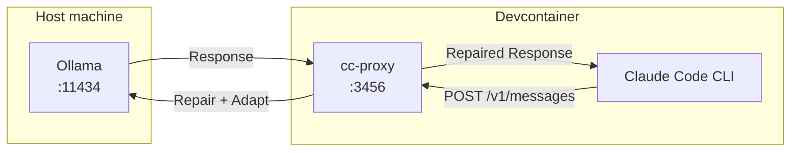

# cc-proxy Overview

**A production-grade proxy for running Claude Code with local Ollama models**

---

## Why cc-proxy exists

Claude Code is a powerful AI coding assistant, but it requires an Anthropic API subscription. If you want to run Claude Code with **local open-source models** (via Ollama), you face several challenges:

1. **Local models produce malformed tool calls** — missing IDs, stringified JSON inputs, hallucinated tool names
2. **Claude Code expects strict Anthropic format** — any deviation breaks the agent workflow
3. **Limited observability** — when things fail, it's hard to diagnose why
4. **No capability awareness** — you don't know which local models support tool calling

**cc-proxy solves this gap** by acting as an intelligent middleware layer that repairs, validates, and adapts requests/responses between Claude Code and Ollama.

---

## Who is this for?

cc-proxy is designed for developers who want to:

- **Run Claude Code offline** or in air-gapped environments
- **Use local models** for cost savings or privacy
- **Own the full stack** — no dependency on external APIs or Node.js runtimes
- **Debug agent failures** with production-grade observability
- **Integrate with Python/FastAPI** ecosystems

**Not for you if:**
- You have an Anthropic API subscription and are happy with it → use the API directly
- You need 100% reliable agent workflows → local models have quality gaps
- You prefer turnkey solutions → consider [LiteLLM](https://docs.litellm.ai/docs/providers/litellm_proxy) or [Claude Code Router](https://github.com/musistudio/claude-code-router)

---

## What problem does cc-proxy solve?

### The Core Pain: Local Models Break Claude Code's Agent Workflow

Ollama (v0.14.0+) provides native Anthropic API compatibility (`/v1/messages`), which means you *can* point Claude Code at Ollama directly. **But it doesn't work reliably** because:

| Problem | Impact | cc-proxy Solution |
|---------|--------|-------------------|
| **Missing tool_use IDs** | Claude Code rejects responses | Generate deterministic hash-based IDs |
| **Stringified JSON in `input`** | `{"input": "{\"location\":\"Berlin\"}"}` | Parse and unwrap stringified JSON |
| **Hallucinated tool names** | Claude Code calls non-existent tools | Validate against request tool list, drop invalid |
| **Unsupported params** | Ollama rejects `reasoning_effort`, `prompt_caching` | Strip known-breakers before forwarding |
| **Unknown model capabilities** | Request tools from incapable models | Detect via `/api/show` + config whitelist |
| **No debugging visibility** | Silent failures, hard to diagnose | Structured JSON logs + OpenTelemetry traces |

### Real-World Example

**Without cc-proxy:**
```json
// Ollama returns malformed tool_use (missing ID, stringified input)
{
  "type": "tool_use",
  "name": "get_weather",
  "input": "{\"location\":\"Berlin\"}"
}
```
→ Claude Code crashes or ignores the tool call

**With cc-proxy:**
```json
// cc-proxy repairs before returning to Claude Code
{
  "type": "tool_use",
  "id": "toolu_a1b2c3d4",  // ✅ Generated hash-based ID
  "name": "get_weather",
  "input": {"location": "Berlin"}  // ✅ Parsed JSON object
}
```
→ Claude Code executes the tool successfully

---

## Key Features

### Deterministic Tool Repair

cc-proxy applies an ordered repair pipeline to every response:

1. **Parse stringified JSON** — unwrap `"input": "{...}"` → `"input": {...}`
2. **Generate missing IDs** — SHA256 hash of `(name, input, position)` for reproducibility
3. **Validate tool names** — case-insensitive matching against request tool list
4. **Drop unrepairable blocks** — replace with text warning instead of crashing

**Result:** Local models' tool-call defects are corrected before Claude Code sees them.

### Production Observability

- **Structured JSON logs** with `trace_id`/`span_id` correlation
- **Request ID propagation** (`X-Request-ID` header)
- **Event-based logging** for auth, endpoint, thinking, tool repairs
- **OpenTelemetry spans** for distributed tracing
- **Warning headers** (`X-CC-Proxy-Warning`) when repairs occur

**Result:** When failures happen, you can trace exactly what went wrong.

### Capability Awareness

Hybrid detection system:
1. **Config whitelist** (explicit) — `tool_calling_capable_models` in `cc-proxy.yaml`
2. **Ollama metadata** (automatic) — query `/api/show` endpoint for `capabilities` array
3. **Fail-fast** — return 400 error if tools requested from incapable model

**Result:** You know which models support tool calling before wasting requests.

### Flexible Authentication

- Accepts **both** `Authorization: Bearer` and `x-api-key` headers
- Enforces auth at the proxy boundary (Ollama runs unauthenticated on host)
- Compatible with Claude Code's multiple auth modes

### Thinking Block Policy

- Detects thinking-capable models via config (`thinking_capable_models`)
- Drops `thinking`/`redacted_thinking` blocks for non-capable models
- Emits warning headers and log events when blocks are dropped

### Request Adaptation

- Strips unsupported Anthropic fields: `metadata`, `tool_choice`, `prompt_caching`, `cache_control`
- Detects `"use_tools"` marker and injects system instruction to force tool usage
- Resolves model aliases (`sonnet` → `qwen3:14b`) via user config

---

## How it works (architecture)



**Request Flow:**
1. Claude Code sends Anthropic Messages API request
2. cc-proxy authenticates (Bearer or x-api-key)
3. Strips unsupported fields, resolves model alias
4. Checks model capability (whitelist or `/api/show`)
5. Forwards to Ollama's `/v1/messages`
6. Receives response, applies tool repair pipeline
7. Returns Anthropic-compatible response to Claude Code
8. Logs structured events with trace correlation

---

## When to use cc-proxy vs alternatives

### Use cc-proxy if:
- ✅ You need **deterministic tool repair** with visibility
- ✅ You want **Python/FastAPI** stack (no Node.js)
- ✅ You need **production observability** (OTel, structured logs)
- ✅ You want to **own and customize** the repair logic
- ✅ You're okay with **local model quality limitations**

### Use Anthropic API if:
- ✅ You need **100% reliable agent workflows**
- ✅ You have an API subscription
- ✅ You value **zero maintenance** over cost/privacy

### Use LiteLLM if:
- ✅ You need **multi-provider routing** (AWS, Azure, GCP, Anthropic)
- ✅ You want **cost tracking and guardrails**
- ✅ You don't need custom tool repair logic
- ✅ You trust upstream dependency updates

### Use Claude Code Router (CCR) if:
- ✅ You're comfortable with **Node.js runtime**
- ✅ You need **JavaScript-based routing logic**
- ✅ You want **multi-provider failover** out-of-the-box
- ✅ CCR's `tooluse` transformer meets your needs

---

## Configuration Reference

### Server Config (`cc_proxy/cc-proxy.yaml`)

```yaml
schema_version: 1
default_alias: sonnet

# Models that support thinking blocks
thinking_capable_models:
  - qwen3:14b
  - qwen3:8b

# Models that support tool calling (whitelist)
tool_calling_capable_models:
  - qwen3:14b
  - qwen3:8b

# Enable verbose tool repair logging
verbose_tool_logging: false
```

### User Config (`~/.cc-proxy/cc-proxy.user.yaml`)

```yaml
aliases:
  sonnet:
    model: qwen3:14b
  haiku:
    model: qwen3:8b
  opus:
    model: qwen2.5-coder:14b

# Optional: enable debug logging
debug_logging:
  request_headers: true
  request_body: true
  response_headers: true
  response_body: true
```

### Environment Variables

```bash
# Required
CC_PROXY_AUTH_KEY=your-secret-key-here

# Optional
OLLAMA_BASE_URL=http://host.docker.internal:11434  # Default
OLLAMA_TIMEOUT_SECONDS=120  # Default (supports ms, s, m, h suffixes)
OTEL_EXPORTER_OTLP_ENDPOINT=http://localhost:4317  # Optional OTel Collector
```

---

## Observability

### Structured JSON Logs

Every request produces structured logs:
```json
{
  "ts": "2026-02-05T12:00:00.123Z",
  "level": "info",
  "service": "cc-proxy",
  "event": "tool.use.repaired",
  "trace_id": "4bf92f3577b34da6a3ce929d0e0e4736",
  "span_id": "00f067aa0ba902b7",
  "request_id": "uuid",
  "model": "qwen3:14b",
  "stats": {
    "parsed_stringified_input": 1,
    "added_ids": 1,
    "dropped_invalid_tools": 0
  }
}
```

### Warning Headers

When repairs occur, cc-proxy adds response headers:
```
X-CC-Proxy-Warning: tool_use_repaired
X-CC-Proxy-Warning: tool_use_dropped
```

### Key Events

| Event | Description |
|-------|-------------|
| `auth.result` | Authentication success/failure |
| `model.resolved` | Model alias resolution |
| `thinking.block_handled` | Thinking blocks dropped/kept |
| `tool.capability.detected` | Model capability check result |
| `tool.use.repaired` | Tool repair summary stats |
| `tool.use.dropped` | Invalid tool blocks dropped |
| `tool.use.repair.details` | Verbose per-block repair details |

---

## Known Limitations

### 1. Local Models Have Quality Gaps

**cc-proxy cannot fix fundamental model limitations:**
- Models that don't understand tool calling will fail even with repair
- Multi-step agent workflows may break unpredictably
- Tool selection accuracy depends on model quality

**Mitigation:** Use tool-capable models (qwen3:14b, qwen3:8b tested), test your specific workflows.

### 2. No Streaming Support (Yet)

Currently only supports non-streaming responses. Streaming support is planned (Phase 6).

### 3. Repair is Best-Effort

The repair pipeline handles common defects but cannot guarantee success:
- Unrepairable JSON → block dropped with text warning
- Unknown tool names → block dropped
- Malformed structure → may pass through or fail validation

**Mitigation:** Enable `verbose_tool_logging: true` to debug failures.

### 4. Maintenance Burden

You own the code and must:
- Update when Anthropic API changes
- Track Ollama compatibility updates
- Debug issues yourself

**Mitigation:** Active community testing, comprehensive test suite (50+ tests).

---

## Testing

cc-proxy includes 50+ tests covering:
- ✅ Authentication (Bearer + x-api-key)
- ✅ Tool repair (stringified JSON, missing IDs, invalid names)
- ✅ Capability detection (whitelist + Ollama metadata)
- ✅ Thinking policy (drop/keep based on model)
- ✅ Request adaptation (field stripping, "use_tools" marker)
- ✅ Observability (JSON logs, OTel spans, warning headers)
- ✅ End-to-end Claude Code integration

Run tests:
```bash
pytest cc_proxy/tests/ -v
```

---

## Documentation

- **[Architecture](cc-proxy-architecture.md)** — system design and code flow
- **[Translation Rules](cc-proxy-translation.md)** — request/response adaptation details
- **[Implementation Plan](cc-implementation-plan.md)** — phase-by-phase build plan
- **[Authentication](cc-proxy-authentication.md)** — auth contract details
- **[Logging](cc-proxy-logging.md)** — observability and OpenTelemetry
- **[CLAUDE.md](CLAUDE.md)** — AI agent onboarding guide

---

## Contributing

cc-proxy is designed to be extended:
- Add new repair passes in `tool_repair.py`
- Customize capability detection in `capability.py`
- Add observability events in `observability.py`
- Extend routing logic in `routing.py`

All changes must:
1. Include unit tests
2. Update documentation
3. Pass existing test suite

---

## Support & Troubleshooting

### Common Issues

**Issue:** Claude Code shows "Select login method"
- **Fix:** Check `~/.claude/settings.json` has `ANTHROPIC_BASE_URL` and `ANTHROPIC_AUTH_TOKEN`

**Issue:** 400 error "Model does not support tool calling"
- **Fix:** Add model to `tool_calling_capable_models` whitelist in config

**Issue:** Tool calls ignored by local model
- **Fix:** Model may not understand tool calling; try a different model or add `"use_tools"` marker

**Issue:** No logs appearing
- **Fix:** Logs go to stdout; check console where cc-proxy is running

**Issue:** Ollama unreachable
- **Fix:** Ensure Ollama running on host, check `OLLAMA_BASE_URL=http://host.docker.internal:11434`

### Debug Checklist

1. Enable verbose logging:
   ```yaml
   # ~/.cc-proxy/cc-proxy.user.yaml
   verbose_tool_logging: true
   debug_logging:
     request_body: true
     response_body: true
   ```

2. Check cc-proxy logs for events:
   ```bash
   # Filter for tool repair events
   make proxy-start 2>&1 | jq 'select(.event | startswith("tool"))'
   ```

3. Verify Ollama model capabilities:
   ```bash
   curl http://localhost:11434/api/show -d '{"name": "qwen3:14b"}'
   ```

4. Test with minimal request:
   ```bash
   curl -X POST http://localhost:3456/v1/messages \
     -H "Authorization: Bearer $CC_PROXY_AUTH_KEY" \
     -H "Content-Type: application/json" \
     -d '{"model":"sonnet","messages":[{"role":"user","content":"hello"}],"max_tokens":16}'
   ```

---

## Summary

**cc-proxy is a production-grade proxy that makes local Ollama models work reliably with Claude Code** by repairing tool-call defects, enforcing capability checks, and providing observability.

**Use it when:** You need local models + agent workflows + debugging visibility + Python stack.

**Skip it when:** You have Anthropic API access or prefer turnkey solutions like LiteLLM/CCR.

**Reality check:** Local models will never match Anthropic API reliability. cc-proxy makes them *usable*, not *perfect*.
