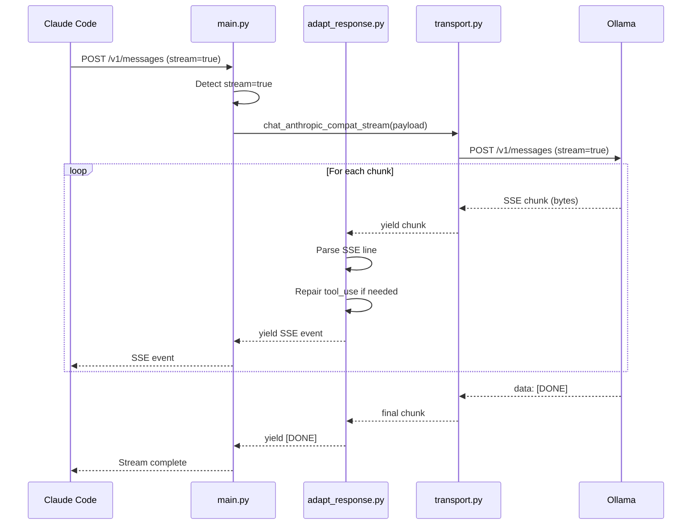

# cc-proxy Streaming Implementation

**A comprehensive guide to streaming support in cc-proxy**

---

## Overview

cc-proxy supports **streaming responses** for the Anthropic-compatible `/v1/messages` endpoint, allowing Claude Code to receive incremental text. Tool-call streaming is supported only when explicitly enabled in config.

**Key capabilities:**
- Server-Sent Events (SSE) format for Anthropic compatibility
- Optional NDJSON fallback parsing (re-emitted as SSE)
- Tool-use repair on `content_block_start` events (limited scope)
- Backward compatible with non-streaming requests
- Thinking policy still applies

---

## How Streaming Works

### Request

Enable streaming by setting `stream: true` in the request:

```json
POST /v1/messages
{
  "model": "sonnet",
  "messages": [{"role": "user", "content": "Count to 10"}],
  "max_tokens": 100,
  "stream": true
}
```

### Response

cc-proxy returns SSE (Server-Sent Events) format with `Content-Type: text/event-stream`:

```
data: {"type":"message_start","message":{"id":"msg_01","type":"message","role":"assistant","content":[],"model":"qwen3:14b"}}

data: {"type":"content_block_start","index":0,"content_block":{"type":"text","text":""}}

data: {"type":"content_block_delta","index":0,"delta":{"type":"text_delta","text":"1"}}

data: {"type":"content_block_delta","index":0,"delta":{"type":"text_delta","text":", 2"}}

data: {"type":"content_block_delta","index":0,"delta":{"type":"text_delta","text":", 3"}}

...

data: {"type":"message_delta","delta":{"stop_reason":"end_turn"},"usage":{"output_tokens":15}}

data: {"type":"message_stop"}

data: [DONE]
```

---

## SSE Event Types

cc-proxy emits the following SSE event types (Anthropic Messages API format):

| Event Type | Description | Example |
|------------|-------------|---------|
| `message_start` | Initial message metadata | `{"type":"message_start","message":{...}}` |
| `content_block_start` | New content block begins | `{"type":"content_block_start","index":0,"content_block":{"type":"text"}}` |
| `content_block_delta` | Incremental content update | `{"type":"content_block_delta","index":0,"delta":{"text":"Hello"}}` |
| `content_block_stop` | Content block complete | `{"type":"content_block_stop","index":0}` |
| `message_delta` | Message-level updates (stop_reason, usage) | `{"type":"message_delta","delta":{"stop_reason":"end_turn"}}` |
| `message_stop` | Stream complete | `{"type":"message_stop"}` |
| `[DONE]` | End-of-stream marker | `data: [DONE]` |

---

## Ollama's Streaming Format

### Native Endpoints vs Anthropic-Compat

Ollama provides two streaming formats depending on the endpoint:

**Native endpoints** (`/api/generate`, `/api/chat`):
- Format: **NDJSON** (newline-delimited JSON)
- Content-Type: `application/x-ndjson`
- No `data:` prefix, just raw JSON per line

**Anthropic-compatible endpoint** (`/v1/messages`):
- Format: **SSE** (Server-Sent Events)
- Content-Type: `text/event-stream`
- Each event prefixed with `data: `

cc-proxy uses the **Anthropic-compatible endpoint** exclusively and expects SSE, but it will also parse NDJSON lines as a fallback and re-emit them as SSE.

**Reference:**
- [Ollama Streaming Documentation](https://docs.ollama.com/api/streaming)
- [Ollama Streaming with Tool Calling Blog](https://ollama.com/blog/streaming-tool)
- [GitHub: SSE Support Request](https://github.com/ollama/ollama/issues/11586)

---

## Tool Calling in Streaming Context

### How Ollama Streams Tool Calls

According to [Ollama's streaming tool blog](https://ollama.com/blog/streaming-tool), Ollama uses an **incremental parser** to identify tool calls as data streams in:

> "Tool calls are streamed out as **fully parsed tool calls** and not the content that's being parsed out."

This means:
- Tool calls arrive as **complete objects** in a single chunk
- You don't get partial JSON like `{"name": "get_wea..."}` across multiple chunks
- Once Ollama's parser recognizes a tool call, it emits the entire `tool_use` block

Tool-call streaming is **gated** by `tool_call_streaming_enabled` (default `false`). If tools are present and `stream=true` while the flag is disabled, the proxy returns `400 invalid_request_error` and asks clients to retry with `stream=false`.

### cc-proxy Tool Repair in Streaming

Streaming tool repair is **limited** to `content_block_start` events containing a `tool_use` block:

1. **Parse event stream** - detect `content_block_start` events with `tool_use` blocks
2. **Repair tool_use block**:
   - Generate missing `id` (SHA256 hash of name + input + position)
   - Parse stringified JSON in `input` field
   - Validate tool name against request tool list (case-insensitive)
3. **Replace invalid tool names** - substitute a text block warning when a tool is unknown
4. **Re-emit as SSE** - send repaired block to Claude Code

Other event types are passed through as-is.

**Example repair in streaming:**

```
Ollama sends:
data: {"type":"content_block_start","index":0,"content_block":{"type":"tool_use","name":"get_weather","input":{"location":"Berlin"}}}
                                                                                   ↑ missing ID

cc-proxy repairs and re-emits:
data: {"type":"content_block_start","index":0,"content_block":{"type":"tool_use","id":"toolu_a1b2c3d4","name":"get_weather","input":{"location":"Berlin"}}}
                                                                                   ↑ ID added
```

---

## Thinking Blocks in Streaming

Ollama supports streaming thinking/reasoning content for capable models. cc-proxy preserves thinking blocks in streaming responses based on the thinking policy.

**Thinking policy applies in streaming:**
- If model is thinking-capable → forward thinking blocks in stream
- If model is NOT thinking-capable → drop thinking blocks, emit warning header

**Example thinking stream:**

```
data: {"type":"content_block_start","index":0,"content_block":{"type":"thinking","thinking":""}}

data: {"type":"content_block_delta","index":0,"delta":{"type":"thinking_delta","thinking":"Let me analyze..."}}

data: {"type":"content_block_stop","index":0}

data: {"type":"content_block_start","index":1,"content_block":{"type":"text","text":""}}
```

**Known issue:** According to [GitHub issue #533](https://github.com/ollama/ollama-python/issues/533), thinking performed during tool calls can be lost in subsequent streaming requests.

---

## Implementation Architecture

### Code Flow



### Key Components

**1. Transport Layer** (`cc_proxy/app/transport.py`)

```python
async def chat_anthropic_compat_stream(
    self, payload: dict[str, Any]
) -> AsyncIterator[bytes]:
    """Stream raw bytes from Ollama's SSE endpoint."""
    url = f"{self._base_url}/v1/messages"
    async with client.stream("POST", url, json=payload) as response:
        async for chunk in response.aiter_bytes():
            yield chunk
```

**2. Response Adapter** (`cc_proxy/app/adapt_response.py`)

```python
async def stream_from_anthropic_compat(
    chunk_iterator: AsyncIterator[bytes],
    *,
    model: str,
    request_tools: list[dict[str, Any]] | None = None,
) -> AsyncIterator[str]:
    """
    Parse SSE stream, apply tool repair, re-emit as SSE.

    Handles:
    - Line buffering across chunk boundaries
    - SSE format parsing (data: {...})
    - Tool repair on complete tool_use blocks
    - Re-emission as valid SSE events
    """
```

**3. Endpoint Handler** (`cc_proxy/app/main.py`)

```python
@app.post("/v1/messages", response_model=None)
async def messages(...):
    is_streaming = adapted.get("stream", False)

    if is_streaming:
        chunk_iterator = client.chat_anthropic_compat_stream(adapted)
        sse_generator = stream_from_anthropic_compat(
            chunk_iterator,
            model=request.model,
            request_tools=request_tools,
        )
        return StreamingResponse(
            sse_generator,
            media_type="text/event-stream",
        )

    # Non-streaming path...
```

---

## Configuration

### Request Parameters

Streaming is controlled by the `stream` field in the request:

```python
{
  "model": "sonnet",
  "messages": [...],
  "stream": true   # Enable streaming
}
```

If `stream` is omitted or `false`, the request uses the non-streaming path.

### Server Settings

Streaming works with existing settings plus the tool-call streaming gate:
- `tool_calling_capable_models` - capability detection works in streaming
- `thinking_capable_models` - thinking policy applies in streaming
- `tool_call_streaming_enabled` - allow tools+stream (default `false`)

---

## Testing Streaming

### Unit Tests

Run streaming tests with the `streaming` pytest marker:

```bash
# All streaming tests
pytest -m streaming

# Specific streaming test
pytest cc_proxy/tests/test_streaming.py -v
```

### Test Coverage

The streaming test suite includes:

1. **Text-only streaming** - validates SSE format, headers, chunk delivery
2. **Tool repair in streaming** - ensures tool_use blocks get IDs injected
3. **Tool-call gating** - tools+stream is rejected when disabled
4. **NDJSON fallback** - NDJSON lines are re-emitted as SSE
5. **Transport errors** - upstream 500 / connection error handling
6. **Non-streaming compatibility** - verifies `stream=false` still works

**All tests use mocked Ollama responses** for speed and reliability.

### Integration Testing

To test with real Ollama:

1. Start Ollama on host: `ollama serve`
2. Pull a model: `ollama pull qwen3:14b`
3. Start cc-proxy: `make proxy-start`
4. Send streaming request:

```bash
curl -N -X POST http://localhost:3456/v1/messages \
  -H "Authorization: Bearer $CC_PROXY_AUTH_KEY" \
  -H "Content-Type: application/json" \
  -d '{
    "model": "sonnet",
    "messages": [{"role": "user", "content": "Count to 10"}],
    "max_tokens": 100,
    "stream": true
  }'
```

**Note:** The `-N` flag disables curl's buffering to show streaming output immediately.

---

## Known Limitations

### 1. Model-Dependent Behavior

Not all local models handle streaming + tool calls reliably. Test your specific model and version.

### 2. Tool Call Streaming Inconsistencies

From [Ollama GitHub issue #12557](https://github.com/ollama/ollama/issues/12557):

> "Ollama's streaming implementation for tool/function calls is incomplete and inconsistent with standard streaming behavior observed in other LLM providers."

**Symptoms:**
- Some models may not emit tool calls in streaming mode
- Behavior varies across model families
- May require `stream: false` fallback for certain tools

**Mitigation:** Test extensively with your target model before deploying to production.

### 3. Thinking Loss During Tool Calls

From [GitHub issue #533](https://github.com/ollama/ollama-python/issues/533):

> "Thinking performed during tool calls can be lost when making subsequent streaming requests."

If your workflow depends on preserving thinking across tool execution rounds, be aware of this limitation.

### 4. No Streaming Repair Stats

Unlike non-streaming requests, repair statistics are **not** returned in response headers for streaming requests.

**Workaround:** Enable `verbose_tool_logging: true` to see repair events in logs.

---

## Performance Considerations

### Latency

Streaming reduces **time-to-first-token** but doesn't change total generation time:

- **Non-streaming:** Wait for full response → receive all at once
- **Streaming:** Receive first chunk immediately → continue receiving until done

**Best for:** Long responses where user needs to see progress.

### Buffering

cc-proxy buffers incomplete lines across chunk boundaries to parse SSE correctly:

```python
buffer = b""
async for chunk in chunk_iterator:
    buffer += chunk
    lines = buffer.split(b"\n")
    buffer = lines[-1]  # Keep incomplete line
    # Process complete lines...
```

**Impact:** Minimal memory overhead (~1KB buffer per request).

### Connection Pooling

The streaming transport reuses the same `httpx.AsyncClient` as non-streaming, benefiting from connection pooling:

```python
# Lifespan-managed client (created once)
app.state.ollama_client = OllamaClient(...)

# Reused for all requests (streaming or not)
client = _get_ollama_client(http_request)
```

---

## Troubleshooting

### Stream Hangs or Times Out

**Symptom:** Stream starts but never completes.

**Causes:**
- Ollama model crashed or stalled
- Network timeout too short
- Model generating very long response

**Solutions:**
1. Check Ollama logs: `docker logs ollama` or `ollama serve` output
2. Increase timeout: `OLLAMA_TIMEOUT_SECONDS=300`
3. Test with shorter `max_tokens`

### No Chunks Received

**Symptom:** Client connects but receives no data.

**Causes:**
- `stream=false` sent instead of `stream=true`
- Ollama not streaming (old version?)
- Middleware buffering responses

**Solutions:**
1. Verify request has `"stream": true`
2. Check Ollama version: `ollama --version` (need v0.14.0+)
3. Use `curl -N` to disable buffering when testing

### Malformed SSE Events

**Symptom:** Parse errors or invalid JSON.

**Causes:**
- Network corruption
- Ollama bug emitting invalid JSON
- Buffer boundary issues

**Solutions:**
1. Enable verbose logging: `verbose_tool_logging: true`
2. Check logs for `tool.use.repair.details` events
3. Capture raw stream for debugging: `tee stream.log`

### Tool Calls Not Appearing

**Symptom:** Text streams but tool_use blocks never arrive.

**Causes:**
- Model doesn't support tool calling in streaming mode
- Ollama version doesn't support streaming + tools
- Model hallucinating instead of calling tools

**Solutions:**
1. Check model capability: `curl http://localhost:11434/api/show -d '{"name":"qwen3:14b"}'`
2. Verify `capabilities` includes `"tools"`
3. Try non-streaming: `"stream": false`
4. Use `"use_tools"` marker to force tool usage

---

## Examples

### Basic Streaming Request (Python)

```python
import requests

url = "http://localhost:3456/v1/messages"
headers = {
    "Authorization": f"Bearer {auth_key}",
    "Content-Type": "application/json"
}
payload = {
    "model": "sonnet",
    "messages": [{"role": "user", "content": "Write a haiku"}],
    "max_tokens": 100,
    "stream": True
}

response = requests.post(url, json=payload, headers=headers, stream=True)

for line in response.iter_lines():
    if line:
        line_str = line.decode('utf-8')
        if line_str.startswith('data: '):
            event = line_str[6:]  # Remove 'data: ' prefix
            if event == '[DONE]':
                break
            print(event)
```

### Streaming with Tool Calls (Python)

```python
import json
import requests

url = "http://localhost:3456/v1/messages"
headers = {"Authorization": f"Bearer {auth_key}"}
payload = {
    "model": "sonnet",
    "messages": [{"role": "user", "content": "What's the weather in Berlin?"}],
    "tools": [{
        "name": "get_weather",
        "description": "Get weather for a location",
        "input_schema": {
            "type": "object",
            "properties": {"location": {"type": "string"}},
            "required": ["location"]
        }
    }],
    "stream": True
}

response = requests.post(url, json=payload, headers=headers, stream=True)

for line in response.iter_lines():
    if line:
        line_str = line.decode('utf-8')
        if line_str.startswith('data: '):
            event_str = line_str[6:]
            if event_str == '[DONE]':
                break

            event = json.loads(event_str)

            # Handle tool_use block
            if event.get('type') == 'content_block_start':
                block = event.get('content_block', {})
                if block.get('type') == 'tool_use':
                    print(f"Tool called: {block['name']}")
                    print(f"Tool ID: {block['id']}")  # cc-proxy added this
                    print(f"Input: {block['input']}")
```

### Non-Streaming Fallback

```python
# Detect if streaming fails, fallback to non-streaming
def chat_with_fallback(payload):
    payload["stream"] = True

    try:
        response = requests.post(url, json=payload, headers=headers, stream=True, timeout=5)
        # Try to read first chunk
        for line in response.iter_lines():
            if line:
                # Streaming works, continue...
                yield line
    except (requests.Timeout, ConnectionError):
        # Streaming failed, use non-streaming
        payload["stream"] = False
        response = requests.post(url, json=payload, headers=headers)
        yield response.json()
```

---

## Best Practices

### 1. Use Streaming for Long Responses

**Good for:**
- Multi-paragraph explanations
- Code generation
- Creative writing
- Reasoning chains

**Not needed for:**
- Short answers (1-2 sentences)
- Simple tool calls
- Quick confirmations

### 2. Handle [DONE] Marker

Always check for the `[DONE]` marker to know when the stream is complete:

```python
for line in response.iter_lines():
    if line.startswith('data: '):
        event = line[6:]
        if event == '[DONE]':
            break
```

### 3. Accumulate Content for History

When building conversation history, accumulate delta content:

```python
accumulated_text = ""
for event in stream:
    if event['type'] == 'content_block_delta':
        delta = event['delta'].get('text', '')
        accumulated_text += delta
        print(delta, end='', flush=True)

# Save accumulated_text to conversation history
```

### 4. Test with Real Models

Don't assume streaming + tools work on all models. Always test:

```bash
# Test streaming
curl -N localhost:3456/v1/messages -d '{"model":"sonnet","stream":true,...}'

# Test tools
curl -N localhost:3456/v1/messages -d '{"model":"sonnet","stream":true,"tools":[...],...}'

# Test thinking
curl -N localhost:3456/v1/messages -d '{"model":"sonnet","stream":true,"messages":[{"role":"assistant","content":[{"type":"thinking",...}]}]}'
```

### 5. Enable Verbose Logging for Debugging

When diagnosing streaming issues:

```yaml
# ~/.cc-proxy/cc-proxy.user.yaml
verbose_tool_logging: true
debug_logging:
  request_body: true
  response_body: false  # Don't log streaming response (too verbose)
```

Check logs for repair events:

```bash
make proxy-start 2>&1 | jq 'select(.event | startswith("tool"))'
```

---

## References

### Ollama Documentation

- [Ollama Streaming Capabilities](https://docs.ollama.com/capabilities/streaming) - Official streaming guide
- [Ollama Streaming with Tool Calling Blog](https://ollama.com/blog/streaming-tool) - How incremental parser works
- [Ollama API Documentation](https://github.com/ollama/ollama/blob/main/docs/api.md) - Complete API reference

### Related Issues

- [GitHub #11586](https://github.com/ollama/ollama/issues/11586) - SSE support request
- [GitHub #12557](https://github.com/ollama/ollama/issues/12557) - Tool streaming inconsistencies
- [GitHub #533](https://github.com/ollama/ollama-python/issues/533) - Thinking loss during tool calls

### cc-proxy Documentation

- [Architecture Overview](cc-proxy-architecture.md) - System design
- [Translation Rules](cc-proxy-translation.md) - Request/response adaptation
- [Implementation Plan](cc-implementation-plan.md) - Phase 6 details
- [CLAUDE.md](../CLAUDE.md) - AI agent onboarding

---

## Summary

**cc-proxy streaming support is stable for text-only**; tool-call streaming is gated and model-dependent.

**Key takeaways:**
- ✅ SSE format for Anthropic compatibility
- ✅ Tool repair applies to `content_block_start` tool_use events
- ✅ Backward compatible with non-streaming
- ⚠️ Tool-call streaming requires `tool_call_streaming_enabled`
- ⚠️ Test your specific model before production

**Quick start:**

1. Add `"stream": true` to your request
2. Parse SSE events (`data: {...}`)
3. Handle `[DONE]` marker
4. Accumulate deltas for conversation history
5. Test with your target model

For questions or issues, check logs with `verbose_tool_logging: true` and refer to the troubleshooting section above.
